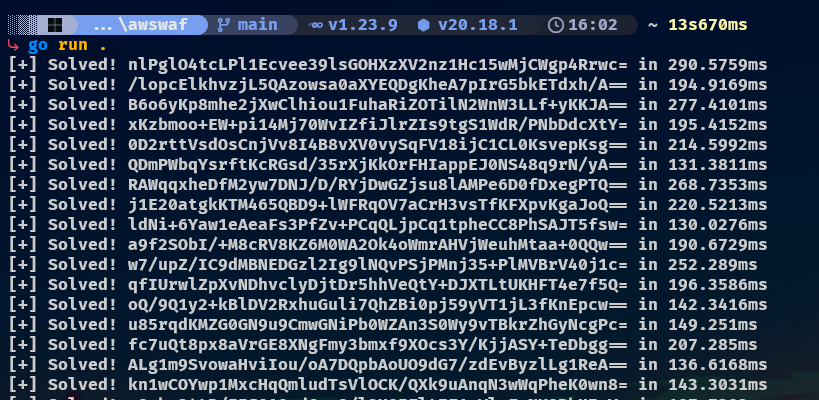

# AWS WAF (Amazon Web Services Web Application Firewall) Solver

<div>
    
    <br>
    
    
    
</div>

--- 

# Overview

This project provides a Golang & Python-based solver for the AWS WAF challenge. It supports both the type "token" / "Invisible" and type "Captcha" using gemini 

---

# ⭐️ Show Your Support

Please star the repository if you find it useful! Your support helps improve the project. ❤️

---

# Usage

## Golang
```go
package main

import (
	"awswaf/internal/aws"
	"log"
)

func main() {
	// host & gokuProps are obtained from the initial response 
	// and can be extracted using aws.Extract(body)
	// proxy can be "" to use no proxy at all
	waf, err := aws.NewAwsWaf(
		host,
		"www.binance.com",
		"Mozilla/5.0 (Windows NT 10.0; Win64; x64) AppleWebKit/537.36 (KHTML, like Gecko) Chrome/137.0.0.0 Safari/537.36",
		gokuProps, proxy,
	)
	if err != nil {
		log.Println(err)
		return
	}
	
	token, err := waf.Run()
	if err != nil {
		log.Println(err)
		return
	}
	// the token is the aws-waf-token cookie
}

```

See [main.go](main.go) for a full example

---

## Python

```python
from awswaf.aws import AwsWaf

token = AwsWaf(goku, endpoint, "www.binance.com")()

# the token is the aws-waf-token cookie
```

See [main.py](python/main.py) for a full example

---

## License

This project is licensed under the **MIT License** - see the [LICENSE](LICENSE) file for details.

---

## Star History

 <picture>
   <source media="(prefers-color-scheme: dark)" srcset="https://api.star-history.com/svg?repos=xKiian/awswaf&type=Date&theme=dark" />
   <source media="(prefers-color-scheme: light)" srcset="https://api.star-history.com/svg?repos=xKiian/awswaf&type=Date" />
   
 </picture>

---

## Disclaimer 

This package is **unofficial** and not affiliated with **Amazon or AWS**. Use it responsibly
and in accordance with AWS's terms of service.